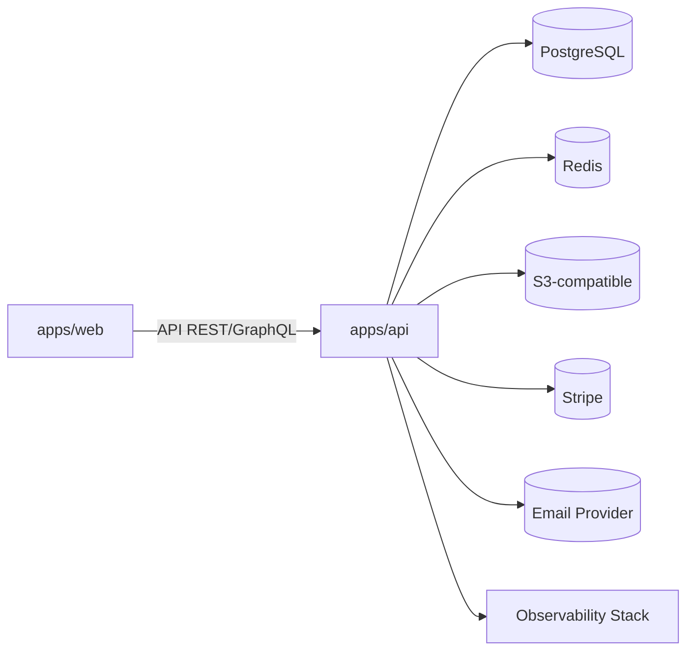

# WebSmith Studio

> Plataforma SaaS para generar y desplegar sitios web modernos a partir de instrucciones en lenguaje natural o wizards guiados.

## Tabla de contenidos
- [Visión general](#visión-general)
- [Arquitectura](#arquitectura)
- [Stack tecnológico](#stack-tecnológico)
- [Requisitos](#requisitos)
- [Primeros pasos](#primeros-pasos)
- [Scripts disponibles](#scripts-disponibles)
- [Estructura de carpetas](#estructura-de-carpetas)
- [Configuración de entorno](#configuración-de-entorno)
- [Guía de desarrollo local](#guía-de-desarrollo-local)
- [Guía de despliegue](#guía-de-despliegue)
- [Testing y calidad](#testing-y-calidad)
- [Observabilidad](#observabilidad)
- [Seguridad](#seguridad)
- [Accesibilidad](#accesibilidad)
- [Resultados Lighthouse](#resultados-lighthouse)
- [Roadmap](#roadmap)
- [Decisiones y trade-offs](#decisiones-y-trade-offs)

## Visión general
WebSmith Studio permite a equipos no técnicos generar landing pages, blogs, portfolios y micrositios completos aprovechando un editor visual con drag & drop, plantillas optimizadas para SEO, generación asistida por IA y despliegues automatizados a plataformas como Vercel y Netlify.

## Arquitectura
Monorepo gestionado con pnpm workspaces que alberga aplicaciones de frontend (Next.js) y backend (NestJS) además de paquetes compartidos (UI, tipos, configuración). Se adopta una arquitectura hexagonal/DDD:



Los módulos backend se segmentan en capas `domain`, `application` y `infrastructure`. El frontend consume los contratos expuestos en `packages/types` y comparte design tokens desde `packages/ui`.

Diagramas C4 se encuentran en `docs/architecture/`.

## Stack tecnológico
- **Frontend**: Next.js 14 (App Router), React 18, TypeScript, TailwindCSS, Headless UI, Zustand, React Hook Form, i18next, DnD Kit.
- **Backend**: NestJS 10, Fastify adapter, TypeScript, Prisma, Zod, BullMQ, Pino, OpenTelemetry, Helmet.
- **Base de datos**: PostgreSQL (multi-tenant por `tenant_id`).
- **Infraestructura**: Docker, docker-compose, Terraform (esqueleto), Fly.io/Render (guía), GitHub Actions CI/CD.
- **Otros**: Stripe, Resend (mockeable), MinIO, Redis, Prometheus/Grafana stack opcional.

## Requisitos
- Node.js 18+
- pnpm 8+
- Docker + Docker Compose v2
- Make (opcional)

## Primeros pasos
```bash
pnpm install
pnpm run setup
```

> `pnpm run setup` ejecuta migraciones, genera el cliente de Prisma y aplica seeds de datos de ejemplo.

## Scripts disponibles
| Script | Descripción |
| --- | --- |
| `pnpm dev` | Levanta frontend y backend en modo desarrollo. |
| `pnpm lint` | Ejecuta ESLint y valida formateo con Prettier. |
| `pnpm test` | Ejecuta suites unitarias, de integración y E2E. |
| `pnpm build` | Genera artefactos de producción para todas las apps. |

## Estructura de carpetas
```
.
├── apps
│   ├── api
│   └── web
├── packages
│   ├── config
│   ├── database
│   ├── types
│   └── ui
├── docs
│   ├── accessibility
│   ├── architecture
│   └── security
```

## Configuración de entorno
Variables descritas en `.env.example`. Cada app consume configuración tipada desde `packages/config`.

## Guía de desarrollo local
1. `pnpm install`
2. `docker compose up -d`
3. `pnpm --filter packages/database prisma migrate deploy`
4. `pnpm --filter packages/database prisma db seed`
5. `pnpm dev`

## Guía de despliegue
Consulte [docs/deployment.md](docs/deployment.md) para instrucciones TL;DR y detalladas (Fly.io/Render + Vercel/Netlify).

## Testing y calidad
- Unit tests: Jest (backend) y Vitest/Testing Library (frontend).
- Integración: Supertest para endpoints NestJS.
- E2E: Playwright simula flujo completo (registro → creación → generación → export → deploy mock).
- Cobertura reportada en `coverage/`.

## Observabilidad
- Logs estructurados (Pino) enviados a stdout.
- Métricas expuestas en `/metrics` (Prometheus).
- Tracing OpenTelemetry con exportador OTLP configurable.

## Seguridad
- Hash Argon2id, JWT + refresh con rotación, CSRF tokens en formularios, sanitización con DOMPurify en frontend.
- Rate limiting por IP/tenant con Redis.
- Auditoría de dependencias vía `pnpm audit` en CI.

## Accesibilidad
Checklist y resultados disponibles en `docs/accessibility/checklist.md`.

## Resultados Lighthouse
Reportes reproducibles en `docs/architecture/lighthouse.md`.

## Roadmap
- Integración IA generativa on-premise.
- Builder colaborativo multiusuario en tiempo real.
- Template marketplace.

## Decisiones y trade-offs
Ver [docs/architecture/decisions.md](docs/architecture/decisions.md).
