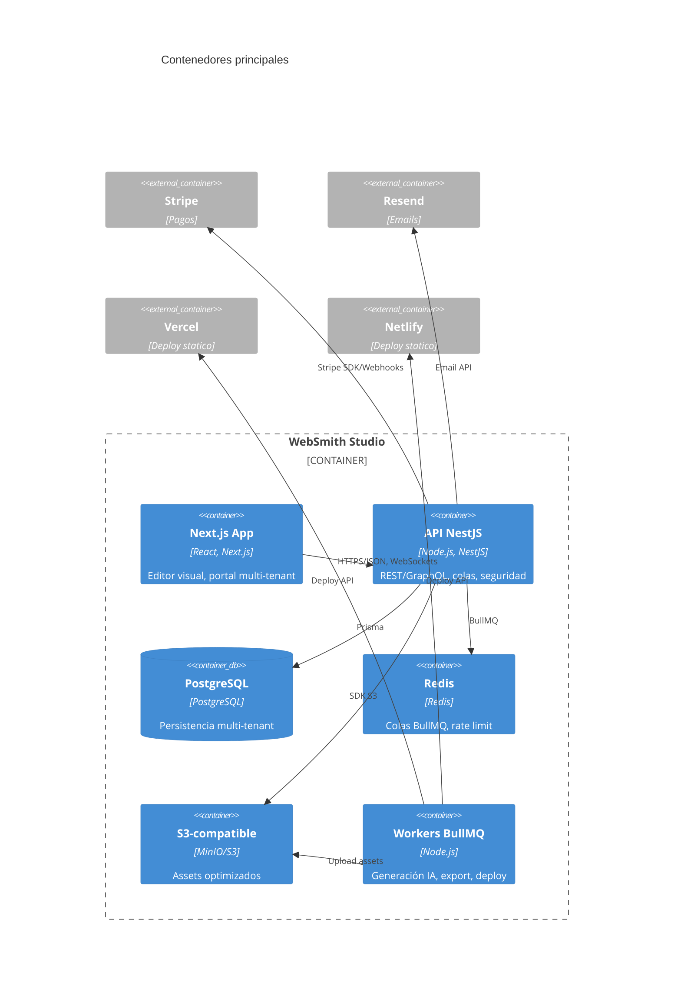

# C4 - Nivel Contenedor

```mermaid
C4Container
    title Contenedores principales
    Container_Boundary(websmith, "WebSmith Studio") {
      Container(web, "Next.js App", "React, Next.js", "Editor visual, portal multi-tenant")
      Container(api, "API NestJS", "Node.js, NestJS", "REST/GraphQL, colas, seguridad")
      ContainerDb(db, "PostgreSQL", "PostgreSQL", "Persistencia multi-tenant")
      Container(redis, "Redis", "Redis", "Colas BullMQ, rate limit")
      Container(storage, "S3-compatible", "MinIO/S3", "Assets optimizados")
      Container(worker, "Workers BullMQ", "Node.js", "Generación IA, export, deploy")
    }
    Container_Ext(stripe, "Stripe", "Pagos")
    Container_Ext(resend, "Resend", "Emails")
    Container_Ext(vercel, "Vercel", "Deploy statico")
    Container_Ext(netlify, "Netlify", "Deploy statico")

    Rel(web, api, "HTTPS/JSON, WebSockets")
    Rel(api, db, "Prisma")
    Rel(api, redis, "BullMQ")
    Rel(api, storage, "SDK S3")
    Rel(worker, storage, "Upload assets")
    Rel(worker, vercel, "Deploy API")
    Rel(worker, netlify, "Deploy API")
    Rel(api, stripe, "Stripe SDK/Webhooks")
    Rel(api, resend, "Email API")
```
