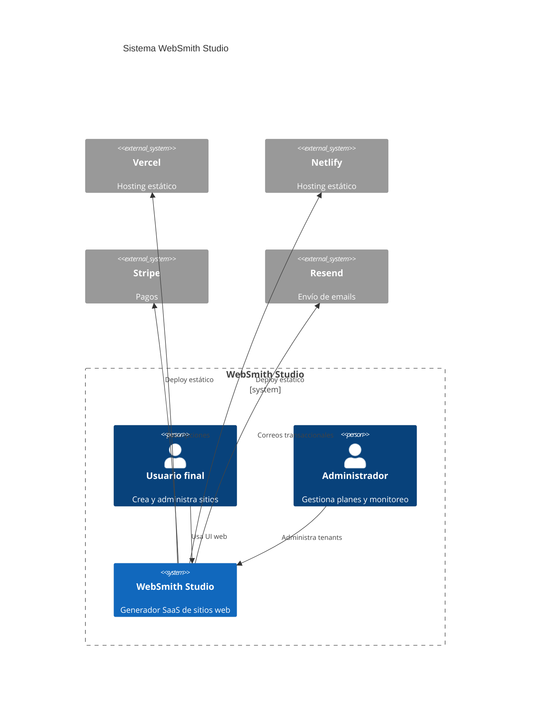

# C4 - Nivel Contexto

```mermaid
C4Context
    title Sistema WebSmith Studio
    Boundary(websmith, "WebSmith Studio") {
      Person(user, "Usuario final", "Crea y administra sitios")
      Person(admin, "Administrador", "Gestiona planes y monitoreo")
      System(system, "WebSmith Studio", "Generador SaaS de sitios web")
    }
    System_Ext(vercel, "Vercel", "Hosting estático")
    System_Ext(netlify, "Netlify", "Hosting estático")
    System_Ext(stripe, "Stripe", "Pagos")
    System_Ext(resend, "Resend", "Envío de emails")

    Rel(user, system, "Usa UI web")
    Rel(admin, system, "Administra tenants")
    Rel(system, vercel, "Deploy estático")
    Rel(system, netlify, "Deploy estático")
    Rel(system, stripe, "Suscripciones")
    Rel(system, resend, "Correos transaccionales")
```
